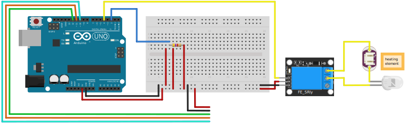

# brew-temperature-control
Simple temperature control for arduino

## resources
* [Guide for DS18B20 Temperature Sensor with Arduino](https://randomnerdtutorials.com/guide-for-ds18b20-temperature-sensor-with-arduino/)
* [MAX7219-8-Digit-7-Segment](http://www.ardumotive.com/8-digit-7seg-display-en.html)
