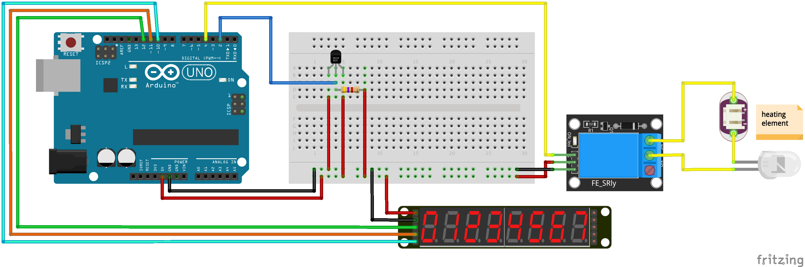

# brew-temperature-control
Simple temperature control for arduino

## Work in Progress
- [x] add display (8 digit 7-segment display with MAX7219) to sketch
- [ ] combine code snippets into one programm that
    - [ ] continuously displays the current temperature 
    - [ ] switches the heating element on and off according to a target temperature
    - [ ] use some propper algorithm in order to avoid oscilation

## Used Resources
* [Guide for DS18B20 Temperature Sensor with Arduino](https://randomnerdtutorials.com/guide-for-ds18b20-temperature-sensor-with-arduino/)
* [MAX7219-8-Digit-7-Segment](http://www.ardumotive.com/8-digit-7seg-display-en.html)
